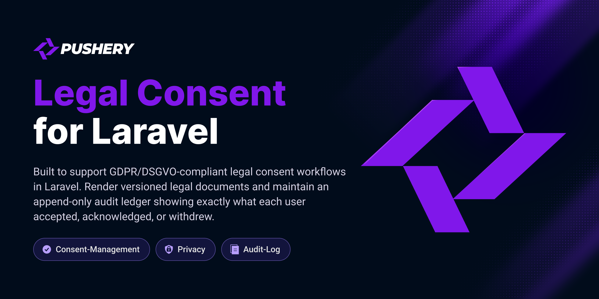

<p align="center">
  <a href="https://github.com/pushery/legal-consent-for-laravel">
    
  </a>
</p>

# Legal Consent for Laravel

[](https://packagist.org/packages/pushery/legal-consent-for-laravel)
[](https://packagist.org/packages/pushery/legal-consent-for-laravel)
[](https://phpstan.org)
[](https://laravel.com/docs/pint)
[](LICENSE)

Court-proof, versioned legal consent for Laravel. It is a **document-acceptance
ledger**: the package **renders and proves** your legal texts — it does not own them.

## Why this exists

A registration does **three legally distinct things**, and treating them as one
(a single "I accept everything" checkbox) is a common — and real — GDPR violation:

| Document | Legal basis | UI | Blocking? | Withdrawable? |
|---|---|---|---|---|
| **Terms / contract** | Art. 6(1)(b) — contract | "I accept …" checkbox | yes | no (you cancel, not withdraw) |
| **Privacy notice** | Art. 13/14 — information | "I have read …" — **never** "I consent" | takes notice | n/a |
| **Marketing / analytics** | Art. 6(1)(a) — consent | separate, granular opt-in | **no** (Art. 7(4)) | yes, any time (Art. 7(3)) |

This package keeps them separate by design, and proves acceptance the way the law
requires (Art. 7(1); EDPB 05/2020 §108): it stores the **exact text a user was shown**,
its version and hash, and the server-side context — not just a timestamp.

Highlights:

- **Append-only audit ledger** — every acceptance/acknowledgement/withdrawal is one
  immutable row with denormalized proof (hardened by a DB trigger on Postgres/MySQL and
  an app-layer guard everywhere).
- **Versioned documents** — a SHA-256 hash detects a change; you classify it material or
  editorial; only a material change (a new major version) forces re-consent.
- **Delayed notice + grace period** — announce a material change, then enforce it 60 days
  later (§ 675g BGB / BGH XI ZR 26/20), with a non-blocking countdown banner.
- **Interchangeable content sources** — Markdown files (default), the database, or any
  foreign CMS via a small resolver.
- **Fortify-optional** — record consent three ways (a trait, an event listener, or a
  headless JSON API). `laravel/fortify` is never required.
- **Optional, off by default** — a tamper-evidence hash chain (`legal-consent:verify-ledger`),
  an Art. 8 age gate, and multi-tenancy scoping — each a single config switch.
- **Optional reactive UI** — plain Blade stubs by default; opt-in Livewire components and a
  WireKit-flavored variant when you want them (no hard Livewire/Flux dependency).

## Compatibility

| | Supported |
|---|---|
| **PHP** | 8.4, 8.5 |
| **Laravel** | 13.x |
| **Databases** | SQLite · PostgreSQL · MySQL 8.4 LTS |

Every database-touching path is tested against real PostgreSQL **and** real MySQL 8.4 (not
just SQLite), so it runs on Laravel Cloud (serverless Postgres + MySQL 8.4 LTS) out of the
box. PostgreSQL is primary, but the append-only and one-active-version guarantees are
enforced portably in the app layer on every engine.

## Installation

```bash
composer require pushery/legal-consent-for-laravel
```

The service provider is registered automatically. Publish the config and run the
migrations:

```bash
php artisan vendor:publish --tag=legal-consent-config
php artisan migrate
```

## Quick start

1. **Write your texts** as Markdown with frontmatter at `resources/legal/{type}/{locale}.md`:

   ```markdown
   ---
   version: "1.0.0"
   title: Nutzungsbedingungen
   material: true
   ui_wording: Ich akzeptiere die Nutzungsbedingungen.
   ---
   # Nutzungsbedingungen

   …
   ```

2. **Publish a version** (freezes it into the ledger; you must classify the change):

   ```bash
   php artisan legal-consent:publish terms de --material --enforce-at=2026-09-01
   ```

3. **Give any model a consent ledger** with the trait:

   ```php
   use Illuminate\Foundation\Auth\User as Authenticatable;
   use Pushery\LegalConsent\Concerns\HasLegalConsents;

   class User extends Authenticatable
   {
       use HasLegalConsents;
   }
   ```

4. **Enforce re-consent** by adding the middleware to your authenticated routes:

   ```php
   // bootstrap/app.php
   ->withMiddleware(function (Middleware $middleware): void {
       $middleware->appendToGroup('web', \Pushery\LegalConsent\Http\Middleware\EnsureLegalConsent::class);
   })
   ```

   It redirects to your `legal.consent` route (or returns `409 legal_consent_required`
   for JSON) when a mandatory document has an outstanding new major version.

## Recording consent (three ways)

All three write the same ledger through one recorder and share an idempotency flag, so
they never double-write.

**Way A — Fortify `CreateNewUser` trait** (strongest proof context):

```php
use Pushery\LegalConsent\Concerns\RecordsRegistrationConsent;

class CreateNewUser implements CreatesNewUsers
{
    use RecordsRegistrationConsent;

    public function create(array $input): User
    {
        Validator::make($input, [/* … */] + $this->consentRules(), $this->consentMessages())->validate();

        $user = User::create([/* … */]);

        $this->recordRegistrationConsent($user, $input);

        return $user;
    }
}
```

**Way B — the `Registered` event listener** (no Fortify): it is registered
automatically; toggle it with `legal-consent.registration.listen_to_registered_event`.

**Way C — the headless JSON API** (opt-in via `legal-consent.routes.api`):

```
POST /legal/consent   { "document_key": "newsletter" }  → 201
POST /legal/withdraw  { "document_key": "newsletter" }  → 204 (422 if not withdrawable)
GET  /legal/status                                       → 200 per-document status
```

Or use the facade / manager directly:

```php
use Pushery\LegalConsent\Facades\Consent;
use Pushery\LegalConsent\Support\ConsentContext;
use Pushery\LegalConsent\Enums\ConsentMethod;

Consent::accept($user, 'terms', ConsentContext::forMethod(ConsentMethod::SettingsToggle));
Consent::withdraw($user, 'newsletter', ConsentContext::forMethod(ConsentMethod::SettingsToggle));
$outstanding = Consent::outstanding($user);   // documents still owed
$history = Consent::history($user);           // Art. 15/20 export payload
```

## Versioning, re-consent & the delayed notice

The lifecycle of a material change, end to end:

1. **Publish it with a grace period.** A material change gets a new **major** version and,
   for a *scheduled* change, at least **60 days** between announcement and enforcement
   (§ 675g BGB / BGH XI ZR 26/20). Both dates are validated — you cannot smuggle a short
   lead by omitting `--announce-at`:

   ```bash
   php artisan legal-consent:publish terms de --material \
       --announce-at=2026-07-01 --enforce-at=2026-09-01
   ```

   (An immediate, un-scheduled publish — no dates — is exempt; it has no grace window.)

2. **Notify the affected subjects.** `legal-consent:dispatch-notices` runs hourly (auto
   -scheduled) and, once the announcement date passes, emails everyone who accepted an
   older major. It is watermarked per version, so a re-run never re-sends a completed one.

3. **Show a non-blocking countdown** during the grace window — the subject keeps working;
   nothing is trapped (§ 308 Nr. 5 lit. b BGB). Render the banner with the data from
   `ConsentBanner`:

   ```blade
   @php($pending = app(\Pushery\LegalConsent\Support\ConsentBanner::class)->pendingFor($user, app()->getLocale()))
   @include('legal-consent::consent-banner', ['pending' => $pending, 'consentUrl' => route('legal.consent')])
   ```

4. **Enforce at the deadline.** From `enforce_from`, the middleware blocks the subject
   until they re-accept the new major (an editorial change — same major — never gates).

The distinction is deliberate: a SHA-256 hash **detects** any text change; a human
**classifies** it material or editorial at publish time; `enforce_from` decides **when** a
material change starts gating. The gate compares `major_version` only.

## Content sources

Each document declares a `source` in `config/legal-consent.php`:

- **`markdown`** (recommended) — git-diffable, PR-reviewable `.md` files.
- **`database`** — the active `legal_documents` row (edit via your own admin UI).
- **`cms`** — a foreign CMS. Implement `Pushery\LegalConsent\Content\CmsResolver` (or pass
  an inline closure) that returns a `RawDocument`; the package never learns what a "page" is.

## Commands

| Command | What it does |
|---|---|
| `legal-consent:publish {key} {locale?} --material\|--editorial` | Freeze the current source into a new active version. |
| `legal-consent:check-drift` | Non-zero exit when a source has drifted from its published version (CI/cron). |
| `legal-consent:dispatch-notices` | Notify subjects who owe re-consent (hourly, idempotent, auto-scheduled). |
| `legal-consent:prune` | Delete records past the retention period (default 3 years); the current standing of an active subject is always kept. |
| `legal-consent:cache-flush {key?} {locale?}` | Flush cached, rendered documents. |
| `legal-consent:verify-ledger` | Verify the tamper-evidence hash chain (non-zero exit on a break); only when `tamper_evidence` is on. |

## UI

The core is **headless** — it renders and proves, and never forces a UI framework on you.
Three levels, pick one:

1. **Plain Blade stubs** (default, no dependency) — the consent checkboxes, the grace-period
   banner, and a settings page. Publish and restyle them freely:

   ```bash
   php artisan vendor:publish --tag=legal-consent-views
   ```

2. **Livewire components** (opt-in) — reactive, drop-in versions of the interactive screens:
   `<livewire:legal-consent.reconsent-form />` and `<livewire:legal-consent.consent-settings />`
   (one-click withdraw, Art. 7(3)). They register automatically **only if** you have
   `livewire/livewire` installed, so the package stays dependency-free otherwise.

3. **WireKit-flavored variant** — if your app uses [WireKit](https://wirekit.app), publish
   the WireKit-themed stubs to override the plain ones:

   ```bash
   php artisan vendor:publish --tag=legal-consent-wirekit
   ```

   These are a themed starting point; a fully WireKit-native companion package is planned.

Every variant bakes in the non-negotiable anti-dark-pattern rules: checkboxes are never
pre-checked (Planet49 C-673/17), a real consent is never `required` (Kopplungsverbot
Art. 7(4)), and the full text is always linked and retrievable (clickwrap, § 305 II BGB).

## Configuration

Everything lives in `config/legal-consent.php`. The keys you are most likely to touch:

| Key | Default | What it does |
|---|---|---|
| `documents` | `[]` | The registry: each key maps to its `legal_basis` (`contract` / `acknowledgement` / `consent`) and `source`. |
| `default_locale` · `locales` | `de` · `[de, en]` | The primary locale and the allowed set (publishing an unlisted locale is refused). |
| `fallback_locale` | `de` | When a document is unpublished in the requested locale, fall back to this one instead of failing. |
| `retention_after_end` | `3 years` | How long proof is kept before `legal-consent:prune` removes superseded/orphaned records. |
| `cache.store` · `cache.ttl` | app default · `86400` | Where/how long rendered documents are cached (self-invalidates on a content change). |
| `notifications.channels` | `[mail, database]` | Channels for the re-consent notification. |
| `middleware.allow` | `[]` | Extra route names the gate never blocks (the consent route + `logout` are always allowed). |
| `routes.consent_name` · `routes.api` | — · `false` | The route to redirect to for re-consent; whether the headless JSON API is registered. |

### Optional features (each off by default)

- **`tamper_evidence`** (`false`) — turn on the append-only hash chain. Every new ledger row
  links to the subject's previous one, so a later edit, deletion, or reorder is detectable.
  Audit it with `php artisan legal-consent:verify-ledger` (non-zero exit on a break);
  combine with the DB append-only trigger for the strongest guarantee.

- **`age_gate`** (`enabled: false`, `threshold: 16`) — Art. 8 DSGVO. When on, registration
  additionally requires an `age_confirmed` attestation. The package gates on the
  attestation; verifying the actual age stays your app's job.

- **`tenancy`** (`enabled: false`, `column: tenant_id`) — scope documents and consents per
  tenant. Register a resolver in a service provider's `boot()`:

  ```php
  app(\Pushery\LegalConsent\Support\TenantContext::class)
      ->resolveUsing(fn () => auth()->user()?->tenant_id);
  ```

  Each tenant gets its own active version of a `(key, locale)`; admin sweeps (prune,
  dispatch-notices) run across all tenants.

## Testing

```bash
composer test
```

## Security

Please review the [security policy](SECURITY.md) and report vulnerabilities
privately rather than opening a public issue.

## Built by Pushery

This package is built and maintained by [Pushery](https://www.pushery.com) — a
Berlin-based studio building Laravel applications, SaaS products, and open-source
tools.

Building a Laravel UI? [WireKit](https://wirekit.app), Pushery's open-source
Livewire component kit, gives you a polished component library out of the box.
Browse the rest of our work at [pushery.com](https://www.pushery.com).

## License

The MIT License (MIT). See [LICENSE](LICENSE) for details.
